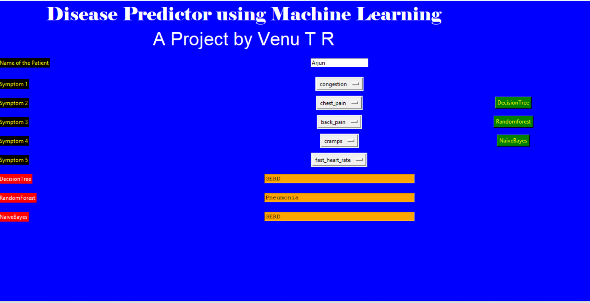
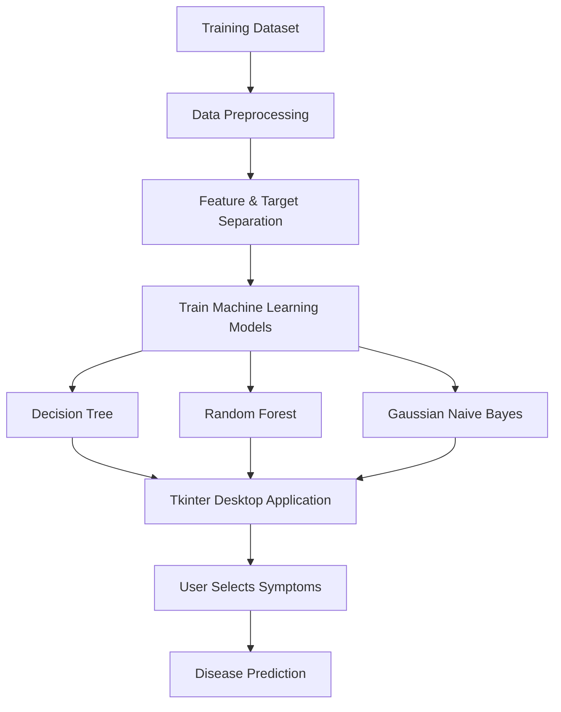

# 🩺 Disease Prediction System using Machine Learning

<p align="center">


</p>

An interactive desktop application that predicts diseases based on user-selected symptoms using Machine Learning classification algorithms.

---

# 📌 Project Overview

The **Disease Prediction System** is a machine learning-based desktop application that predicts the most probable disease based on symptoms selected by the user.

The application uses three supervised machine learning algorithms—**Decision Tree**, **Random Forest**, and **Gaussian Naive Bayes**—to generate predictions through an interactive Tkinter graphical user interface (GUI).

This project demonstrates the complete machine learning workflow, including data preprocessing, model training, model evaluation, and deploying predictions through a desktop application.

---

# 🎯 Problem Statement

Early identification of diseases based on symptoms can assist healthcare professionals in making timely decisions and encourage users to seek appropriate medical consultation.

The objective of this project is to predict diseases from a set of symptoms using supervised machine learning algorithms.

---

# 🛠️ Tech Stack

| Category | Technologies |
|----------|--------------|
| Programming Language | Python |
| Data Processing | Pandas, NumPy |
| Machine Learning | Scikit-learn |
| GUI Development | Tkinter |
| Dataset | Disease Prediction Dataset |

---

# 📂 Dataset

- **Training Dataset:** `Training.csv`
- **Testing Dataset:** `Testing.csv`

The dataset contains various symptoms as input features and their corresponding diseases as the target variable for supervised classification.

---

# 🧹 Data Preprocessing

The following preprocessing steps were performed before model training:

- Loaded training and testing datasets
- Encoded disease labels into numerical values
- Separated input features and target variable
- Prepared symptom-based input for prediction
- Trained classification models using the processed dataset

---

# 🤖 Machine Learning Models

The application predicts diseases using three supervised machine learning algorithms:

- 🌳 Decision Tree Classifier
- 🌲 Random Forest Classifier
- 📊 Gaussian Naive Bayes

Each model independently predicts the disease based on the symptoms selected by the user.

---

# 📊 Model Performance

The models were evaluated using the testing dataset.

| Model | Accuracy |
|--------|---------:|
| Decision Tree | **95.12%** |
| Random Forest | **95.12%** |
| Gaussian Naive Bayes | **95.12%** |

All three models achieved an accuracy of **95.12%**, demonstrating consistent predictive performance on the testing dataset.

---

# 🖥️ Application Preview

<p align="center">

</p>

---

# ⚙️ Project Workflow



---

# ✨ Features

- Interactive desktop application using Tkinter
- Predicts diseases based on user-selected symptoms
- Implements three machine learning classification algorithms
- Compares predictions generated by different models
- User-friendly interface for symptom selection
- Lightweight and easy-to-use application

---

# 📁 Repository Structure

```
Disease-Prediction-System/
│
├── data/
│   ├── Training.csv
│   └── Testing.csv
│
├── screenshots/
│   └── application.png
│
├── disease_prediction.py
├── requirements.txt
├── README.md
├── LICENSE
└── .gitignore
```

---

# 🚀 Installation

Clone the repository

```bash
git clone https://github.com/Venu6311/Disease-Prediction-System.git
```

Navigate to the project directory

```bash
cd Disease-Prediction-System
```

Install the required libraries

```bash
pip install -r requirements.txt
```

Run the application

```bash
python disease_prediction.py
```

---

# 💻 Usage

1. Enter the patient's name.
2. Select up to five symptoms from the dropdown menus.
3. Click any of the machine learning model buttons:
   - Decision Tree
   - Random Forest
   - Gaussian Naive Bayes
4. View the predicted disease displayed by the selected model.

---

# 💡 Future Improvements

- Improve the graphical user interface with a modern design.
- Add more machine learning algorithms for comparison.
- Display prediction confidence scores.
- Deploy the application as a web application using Flask or Streamlit.
- Expand the dataset with additional diseases and symptoms.

---

# 📚 Learning Outcomes

Through this project, I gained practical experience in:

- Data preprocessing using Pandas
- Supervised machine learning
- Classification algorithms
- Model evaluation
- Desktop application development using Tkinter
- Building end-to-end machine learning solutions

---

# ⚠️ Disclaimer

This project is developed for **educational and learning purposes only**.

The predictions generated by the application should **not** be considered professional medical advice or a substitute for consultation with qualified healthcare professionals.

---

# 👨‍💻 Author

**Venu T R**

Bachelor of Engineering in Artificial Intelligence & Machine Learning

Aspiring Data Analyst | Machine Learning Enthusiast

### Skills

- Python
- SQL
- Power BI
- Pandas
- Machine Learning

---

⭐ **If you found this project helpful, consider giving it a Star!**